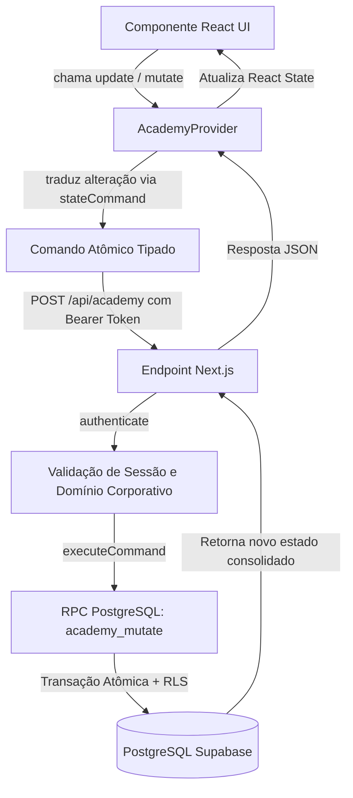

# 🏛️ DOC-Academy — Guia de Arquitetura e Engenharia

Bem-vindo à documentação oficial de arquitetura do **DOC-Academy**, a plataforma corporativa de capacitação contínua e evolução dos colaboradores da **DeMaria**.

Este documento foi elaborado para que qualquer desenvolvedor (humano ou assistente de IA) possa compreender rapidamente a estrutura do projeto, manter a qualidade do código, aplicar novas funcionalidades e garantir a segurança das operações.

---

## 1. Visão Geral e Stack Tecnológica

O **DOC-Academy** prioriza performance, clareza arquitetural e baixo overhead:

- **Frontend & Roteamento:** [Next.js](https://nextjs.org/) (App Router), React 19, TypeScript.
- **Backend & Autenticação:** [Supabase](https://supabase.com/) (PostgreSQL 15+, Auth, Row Level Security, Storage de PDFs privados).
- **Estilização:** CSS moderno modularizado em `platform/src/styles/` integrado com Tailwind CSS v4.
- **Validação e Contratos:** [Zod](https://zod.dev/) para todos os schemas de domínio, payloads de API e integridade de dados.
- **CI/CD & Segurança:** Vercel (deploy contínuo no branch `main`) e GitHub Actions com **Semgrep** para análise estática de segurança (SAST) e verificação de segredos.

---

## 2. Mapa do Repositório

```text
DOC-Academy/
├── .github/
│   └── workflows/
│       └── security.yml       # Scan automatizado de segurança Semgrep (OWASP/CWE)
├── platform/
│   ├── src/
│   │   ├── app/               # Next.js App Router (Páginas e APIs)
│   │   │   ├── page.tsx       # Redirecionamento da raiz (/)
│   │   │   ├── acesso/        # Tela unificada de login e auto-cadastro
│   │   │   ├── aprender/      # Catálogo e sala de aula (/aprender/[id]/aula)
│   │   │   ├── conhecimento/  # Base de conhecimento e guias
│   │   │   ├── conquistas/    # Painel de evolução, ranking e conquistas de XP
│   │   │   ├── equipe/        # Gestão de progresso da equipe (gestores e admins)
│   │   │   ├── admin/         # Painel administrativo (/admin e /admin/[kind]/[id])
│   │   │   ├── sobre/         # Informações do sistema e release notes
│   │   │   └── api/
│   │   │       ├── academy/   # Endpoint central de sincronização e comandos
│   │   │       ├── attachments/ # Upload e leitura de PDFs com URLs assinadas
│   │   │       └── auth/register/ # Auto-cadastro com rate-limiting e restrição de domínio
│   │   ├── components/        # Componentes React
│   │   │   ├── academy-provider.tsx # Estado global, sincronização e mutações
│   │   │   ├── app-shell.tsx  # Layout principal: sidebar, topbar e rodapé
│   │   │   ├── classroom.tsx  # Sala de aula (player de vídeo, leitura, avaliação, modo foco)
│   │   │   ├── vimeo-lesson.tsx # Integração do SDK Vimeo com tracking de progresso
│   │   │   ├── shared.tsx     # CourseCard, CourseArt, botões de ação e paginação
│   │   │   ├── admin/         # Módulos do painel administrativo
│   │   │   │   ├── admin-courses.tsx
│   │   │   │   ├── admin-articles.tsx
│   │   │   │   ├── admin-people.tsx
│   │   │   │   ├── admin-reviews.tsx
│   │   │   │   └── admin-config.tsx
│   │   │   └── editors/       # Editores de recursos
│   │   │       ├── course-editor.tsx
│   │   │       ├── article-editor.tsx
│   │   │       ├── person-editor.tsx
│   │   │       ├── activity-questions.tsx
│   │   │       └── pdf-attachment-editor.tsx
│   │   ├── lib/               # Lógica de negócio e utilitários
│   │   │   ├── model.ts       # Schemas Zod centrais (Course, Lesson, Person, etc.)
│   │   │   ├── pilot-contract.ts # Comandos atômicos traduzidos do estado
│   │   │   ├── pilot-server.ts # Backend: autenticação, queries Supabase e RPCs
│   │   │   ├── course-activities.ts # Validações de curso e atividades
│   │   │   ├── gamification.ts # Cálculo de níveis, temporadas e tiers de XP
│   │   │   ├── rewards.ts     # Cálculo de XP baseado em minutos e atividades
│   │   │   ├── departments.ts # Lista oficial dos 12 departamentos DeMaria
│   │   │   ├── registration-security.ts # Validação de domínios corporativos
│   │   │   └── supabase-browser.ts # Cliente Supabase para o navegador
│   │   └── styles/            # CSS temático modular
│   │       ├── theme.css      # Variáveis de cor, tokens de design e dark mode
│   │       ├── navigation.css # Sidebar, topbar e menus
│   │       ├── cards.css      # Cards de curso, banners, composição e logos
│   │       ├── classroom.css  # Sala de aula, player de vídeo e modo foco
│   │       └── forms.css      # Campos de formulário e editores
│   └── supabase/
│       └── migrations/        # Migrações SQL executadas no banco de dados
├── AGENTS.md                  # Regras de economia de tokens para assistentes de IA
└── ARCHITECTURE.md            # Este guia
```

---

## 3. Fluxo de Dados e Comunicação

### O Padrão `AcademyProvider` + Comandos Atômicos

A aplicação não realiza mutações enviando objetos brutos indiscriminados para o servidor. O fluxo segue o princípio de **mínimo privilégio e validação dupla**:



### Por que esse padrão é seguro e escalável?
1. **Evita Race Conditions:** A função SQL `academy_mutate` utiliza o campo `expectedVersion` para versionamento otimista, impedindo que um administrador sobrescreva acidentalmente as alterações de outro.
2. **Impedimento de Adulteração de XP ou Avaliações:** Alunos nunca podem alterar suas próprias notas, seu XP ou aprovar seus próprios cadastros. Toda permissão é validada no backend em `pilot-server.ts` antes de qualquer escrita.

---

## 4. Modelagem e Schemas de Dados

Todos os modelos residem em `platform/src/lib/model.ts`:

### 4.1. Cursos (`courseSchema`)
- `id`: UUID ou string identificadora única.
- `title`, `description`, `product`, `category`, `level`: Metadados do curso.
- `accent`: Cor temática da capa (`violet`, `mint`, `peach`, `blue`, `pink`, `slate`).
- `banner`: URL HTTPS de imagem externa para a capa (opcional).
- `logoUrl`: URL HTTPS do logotipo PNG transparente do produto exibido no centro do banner (opcional). Se omitido, o sistema renderiza a arte geométrica padrão.
- `lessons`: Lista ordenada de aulas (`lessonSchema`), contendo vídeos Vimeo, leituras ou questionários.
- `questions`: Banco de perguntas do curso.
- `xp`: Pontuação total calculada automaticamente por `courseXp()`.
- `version`: Inteiro incremental para controle de versão.

### 4.2. Aulas (`lessonSchema`)
- `type`: `"video"` | `"reading"` | `"quiz"`.
- `minutes`: Duração estimada (usada para calcular o XP atribuído).
- `videoUrl`: Link do vídeo hospedado no Vimeo.
- `attachmentPath`: Caminho do PDF anexo privado armazenado no Supabase Storage (`academy-pdfs`).
- `attachmentName`: Nome original do PDF para download pelo aluno.

---

## 5. Sistema de Gamificação (XP e Níveis)

A gamificação do DOC-Academy foi desenhada para valorizar o tempo dedicado ao aprendizado real:

| Ação | Recompensa de XP | Arquivo Responsável |
| :--- | :--- | :--- |
| **Aula de até 5 min** | 15 XP | `platform/src/lib/rewards.ts` |
| **Cada bloco adicional de 5 min** | +5 XP | `platform/src/lib/rewards.ts` |
| **Conclusão do curso** | +30 XP | `platform/src/lib/rewards.ts` |
| **Questão objetiva correta** | +5 XP | `platform/src/lib/rewards.ts` |
| **Questão dissertativa aprovada** | +8 XP | `platform/src/lib/rewards.ts` |
| **Aprovação na prova final** | +30 XP (+10 XP em caso de recuperação) | `platform/src/lib/rewards.ts` |

- **Níveis:** Cada nível requer **400 XP**. O nível atual é calculado por `Math.floor(totalXp / 400) + 1` em `platform/src/lib/gamification.ts`.
- **Tiers Anuais:** Bronze (0 XP), Prata (800 XP), Ouro (2.000 XP), Platina (3.500 XP), Diamante (5.000 XP).

---

## 6. Diretrizes de Segurança Aplicadas

1. **Restrição de Domínio Corporativo:** Apenas e-mails terminados em `@demaria.com.br` ou `@sacdemaria.com.br` conseguem se cadastrar ou receber convites (`platform/src/lib/registration-security.ts`).
2. **Aprovação Obrigatória de Novos Usuários:** Novos colaboradores criados via auto-cadastro na tela `/acesso` recebem o status `pending` e só conseguem acessar o catálogo após aprovação de um administrador em `/admin` (aba Pessoas).
3. **Proteção Contra Rate-Limit e Abusos:** O endpoint `/api/auth/register` limita até 5 tentativas a cada 15 minutos por endereço IP.
4. **Armazenamento Seguro de PDFs:** O bucket `academy-pdfs` no Supabase Storage é 100% privado. Arquivos só são lidos através de **URLs pré-assinadas** geradas por `/api/attachments` com validade de apenas 600 segundos (10 minutos) e restritas a alunos matriculados ou administradores.
5. **Sanitização de Uploads:** O backend confere os magic bytes `%PDF-` nos primeiros 5 bytes de qualquer arquivo enviado, garantindo que executáveis renomeados sejam rejeitados.
6. **Análise Contínua Semgrep:** O repositório conta com pipeline automático do Semgrep (`.github/workflows/security.yml`) que verifica vulnerabilidades de injeção, falhas de autorização e exposição de tokens.

---

## 7. Boas Práticas para Desenvolvedores e Contribuidores

- **Edições Modulares:** Ao alterar formulários administrativos, edite os arquivos em `src/components/admin/` ou `src/components/editors/`, mantendo `admin.tsx` e `editors.tsx` como orquestradores leves.
- **Folhas de Estilo Específicas:** Não acumule regras de CSS em `globals.css`. Utilize o arquivo correspondente em `platform/src/styles/` (ex: `classroom.css`, `cards.css`, `navigation.css`).
- **Commits e Branches:** 
  - `dev`: Branch de desenvolvimento e homologação.
  - `main`: Branch de produção (conectado automaticamente ao deploy na Vercel).
- **Verificação de Tipos:** Sempre rode `pnpm typecheck` (`tsc --noEmit`) antes de abrir Pull Requests.
